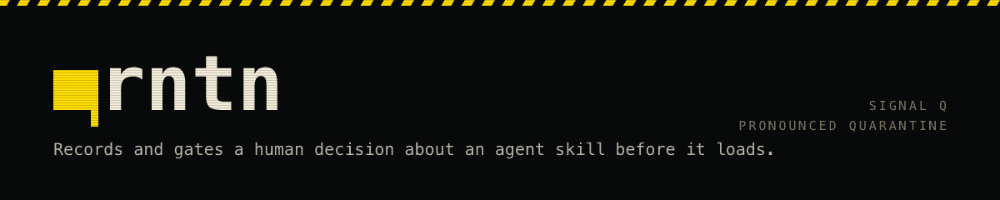

<h1></h1>


**`qrntn` records and gates a human decision about a skill before it is allowed
to load.**

An agent skill is a folder with a `SKILL.md` in it — instructions that Claude
Code, Codex, Cursor, Copilot, Gemini CLI and around forty other products read
straight into an agent's context. Installing one is closer to hiring than to
adding a dependency: the text becomes instructions before any code runs.

`qrntn` is a local, dependency-free command-line tool for taking those in,
auditing them, deciding about them, and keeping the decision. A browser-based
graph viewer that shows the whole library at once — every skill, where it came
from, what the audit found, whether it has ever fired, whether its upstream has
moved — is served by `qrntn view`, locally, against any library you name.

## It is not a scanner

Scanners exist. Cisco, NVIDIA, Socket, Snyk and VirusTotal all ship one, and so
do several open-source projects. Every independent team that has published an
attempt has bypassed the scanners it tested, several inside an hour — which is
not a criticism of any of them. A scanner examines a fixed artefact while
whoever wrote it can keep adjusting until it passes, and that asymmetry is why
detection is not the last line here. `qrntn` has a scanner inside it, and that
is not the claim.

The claim is that **a human decision is recorded against specific bytes, and a
gate enforces that decision without being able to be argued with.** Nothing is
adopted because an agent concluded it looked fine. The closest thing in any
ecosystem is Mozilla's `cargo-vet` for Rust crates: in-tree audit records, named
criteria, a tool that certifies and never edits.

Put plainly: before a skill you downloaded from a stranger runs inside your
agent, someone has to have actually read it. `qrntn` turns that reading into a
permanent record tied to specific bytes, and refuses to install anything that
does not have one.

[`docs/COMPARISON.md`](docs/COMPARISON.md) sets out the four categories this is
routinely mistaken for — scanner, registry signing, evaluation, sandbox — what
each one establishes that the others do not, and how to cite the numbers people
quote about this space. [`docs/THREATS.md`](docs/THREATS.md) is what `qrntn`
does not defend against, which is the more useful half.

## The lifecycle

Every stage below is real and happens today. Two of them do not yet have a
command, and are marked as such — a stage without a verb is a thing you do by
hand, not a thing that does not exist, and deleting the row to make the command
list look complete is precisely the move this tool exists to refuse.

| Stage | What happens | Command |
|---|---|---|
| **intake** | fetch from a link at a pinned commit, *without reading it*, into quarantine | `qrntn intake` |
| **audit** | scan every file as data; a human adjudicates every finding; report only, never edit | `qrntn audit` |
| **adopt / decline / refuse** | the human decides. A declined or refused skill keeps a permanent row, so it is never re-audited from nothing | `qrntn adopt` |
| **promote** | a script re-scans and moves it into the library — or refuses | `qrntn promote` |
| **ledger** | one machine-written record per held skill: origin, hashes, audit verdict, contract, install, usage | `qrntn ledger` |
| **refresh** | re-diff the pinned commit against upstream; report drift, never move the pin | `qrntn refresh` |
| **usage** | count what actually fired, from local transcripts, reading no message text | `qrntn usage` |
| **view** | the graph, served locally against any skill library | `qrntn view` |

```
npx qrntn init                 # once, to make a folder of skills into a library
npx qrntn intake https://github.com/someone/skills/tree/main/foo
npx qrntn audit inbox/foo      # audit takes the path it landed at, not the name
                               # read the report; decide every finding in AUDIT.md
npx qrntn adopt foo            # record the verdict — or --decline / --refuse,
                               # which writes a permanent REJECTED.md row instead
npx qrntn promote foo
npx qrntn refresh
npx qrntn check                # is every skill filed and every record still true
```

Eleven verbs: `init`, `intake`, `audit`, `adopt`, `promote`, `refresh`,
`usage`, `overlap`, `ledger`, `check`, `view`. Run `qrntn` with no arguments
for what each one does.

## The principles it is built on

- **Fetch blind.** Never read what you fetch. An agent that has read the payload
  before the payload was scanned has already lost, and no later gate recovers it.
- **The record makes the decision checkable** — by someone who was not there.
- **The gate cannot be reasoned with.** It is a script, not a sentence in a
  prompt, because the material being processed is untrusted text written to be
  read as instructions.
- **Declining is a success.** A refused skill with a written reason is a finished
  piece of work, not a failure.
- **Nothing leaves the machine.** Two commands reach the network — `intake` and
  `refresh` — and both only to a source you already named. Usage counting reads
  local transcripts and never message text.

## The contracts that do not move

`qrntn` is `0.x`, and the surface may move. Four things will not, because a
publish freezes them whether or not anyone wrote them down.

**Where the library is.** Every verb takes `--library <dir>`, then
`SKILL_LIBRARY`, then the working directory — named, or the place you are
standing, never inferred from where the tool happens to be installed.

**Where installed skills are.** `--install-root <dir>`, then
`SKILL_INSTALL_ROOT`, then `~/.claude/skills`. Looking at them at all is opt-in,
behind `--install`: by default `qrntn` asserts nothing about one vendor's
directory layout on behalf of a user who may load skills from somewhere else. The names
match `SKILL_LIBRARY` rather than a `QRNTN_*` of their own — two naming
conventions in one surface, decided at different times for no recoverable
reason, is its own defect.

**What the exit codes mean.** This convention was consistent across every
command before it was written down anywhere, which is the more dangerous state
rather than a safer one: a later change to one command's exit looks local and
harmless, and there is no line it visibly violates.

| Code | Means | For example |
|---|---|---|
| `0` | clean | every held skill is filed; the pin matches upstream |
| `1` | ran, and the answer is no | `promote` refused; `ledger --check` found a mismatch |
| `2` | could not run | a usage error; not a skill library; no `catalog.json` |

A script consuming these has to tell `1` and `2` apart. Collapsing them is how a
CI gate starts lying about which problem it found.

**What colour does, and does not, change.** Eight verbs colour `refused:`.
`audit` has no such line — it reports rather than refuses, and prefixes the one
thing it cannot do `error:` — and colours its severity column, counts and
verdict instead. The words carry the meaning and the ink is a second copy of
them, so **stripping the escapes reproduces the output byte for byte** — a test
asserts exactly that. Colour is off unless the stream is a terminal, `NO_COLOR`
is honoured on its presence rather than its value, and `FORCE_COLOR` overrides
the terminal check. A script reading this output never has to know, and
`qrntn audit > report.txt` writes a clean file while still colouring the
refusal it prints to stderr.

**What `--no-evidence` withholds.** `audit` prints an excerpt of what matched
under each finding, and that excerpt is text the skill's author chose. When the
reader is an agent rather than a person, `qrntn audit inbox/foo --no-evidence`
keeps every finding's severity, code, file, location and reason and withholds
the bytes: the excerpt, a decoded payload, and any fragment the reason would
have quoted. Counts, verdict and exit code do not change. It is a flag and not a
test of where stdout goes, for the reason [`docs/THREATS.md`](docs/THREATS.md)
gives: a report must not mean different things depending on what it is piped
into.

**Explicitly not frozen:** the `--json` shapes. Most commands emit JSON and
those shapes are still moving in `0.x`.

## Where the code lives

`commands/` holds the pipeline — init, intake, audit, adopt, promote, overlap,
ledger, refresh, usage and the catalog check — with every test and mutation
self-test beside the script it covers. `audit-record.mjs` is the one
statement of what a filled-in `AUDIT.md` contains; `adopt` and `promote` both
read it, so the record one accepts is never one the other refuses.

`view/` in the published package is not source. It is the viewer's build,
plus the graph exporter bundled to one plain-Node file, made at publish time
by `nexus/scripts/build-view.mjs` from the one implementation in `nexus/` —
never reimplemented, never committed. `package.json` declares no dependencies
because none are resolved on your machine; that directory nonetheless carries
three.js, React and zod compiled in, and `NOTICE` says so. A tool about what
enters a library should be plain about what it brings with it. `nexus/` is the viewer. `brand/` is where the
identity was decided — a thesis, and a palette whose every number prints the
command that reproduces it — and `site/` is the page built from those tokens.
`check.mjs` runs the lot,
discovering the suites rather than listing them, because a hand-maintained list
goes stale and the missing entry is invisible.

It was written inside the skill library it was built for, and moved out of it,
in that order and deliberately: co-locating a tool with its only consumer is how
you never discover what the tool assumes about its host. Those assumptions were
measured before the move rather than guessed at after it —
[`docs/PORTABILITY.md`](docs/PORTABILITY.md) is the table of what each command
required of the tree it ran in, and [`docs/SURFACE.md`](docs/SURFACE.md) is what
each command does about it.

The finding that shaped the result: six of seven commands resolved their library
from their own file location, so they could only ever act on the tree they lived
in. They now take it from `--library`, then `SKILL_LIBRARY`, then the working
directory — named, or the place you are standing, never inferred from where the
tool happens to be installed.

## Status

**`qrntn` is on npm**, first published 2026-09-09 on the `latest` tag: eleven
verbs, zero dependencies, `node >= 20`. Every `npx` line above runs, and the
badge above carries the current version rather than this paragraph. The name was
chosen on 2026-09-07, changed to `qrntn` on 2026-09-08 when the first one could
not be taken, and is recorded in SK-90.

`0.1.x` is a quiet release rather than a launch. `adopt` — the verb for the
recorded decision the whole pitch rests on — and `view` are `0.2`, and until
they land the decision is written by hand into `AUDIT.md` and `REJECTED.md`,
which the lifecycle table above marks as such.

From a checkout, `node check.mjs` runs every gate the project has: the suites,
the mutation self-tests, and a smoke gate that packs the tarball, installs it
into a clean directory with `HOME` pointed somewhere empty, and drives every
verb from it. [`docs/SHIPPING.md`](docs/SHIPPING.md) is the plan and marks what
has landed against what has not; [`CHANGELOG.md`](CHANGELOG.md) records what
each release actually contained.

## The name

`qrntn` is *quarantine* with the vowels struck out, and it is pronounced
**quarantine**. You type the consonants and you say the word, the way `qty` and
`mgmt` and `bldg` always have. Yes, you have to be told that once.

A vessel that has arrived and has not yet been inspected flies signal flag Q, a
plain yellow rectangle with nothing printed on it. Held is what this tool does.
*Free pratique* — the clearance entered in a ship's papers, without which nobody
boards and nobody disembarks — is what **you** do, and it was not the tool's to
put in its own name.
